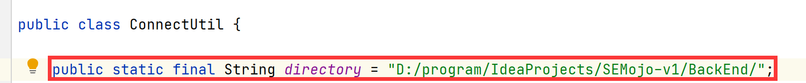

# SEMojo
A website to provide services of advanced software engineering techniques (automated testing, repairing, code generation, code summarization, etc.)

### Development requirements.
+ Enable docker container run technics uploaded.
+ Payment options
+ Support three user groups: admin, contributors,
and customers.
  1. For admin:
       - managing the uploaded techniques
  2. For Contributor:
       - uploading the advanced software engineering techniques
  3. For customers:
       - downloading and feedbacking the techniques 

### Team Member

 + 程千帆 (Qianfan Cheng)
 + 徐品深 (Pingshen Xu)
 + 朱昉 (Fang Zhu)
 + 赵志翔 (Zhixiang Zhao)
  
### Attention
You need to change the url in ConnectUtil.java with the url your stored path of "BackEnd" directory.

